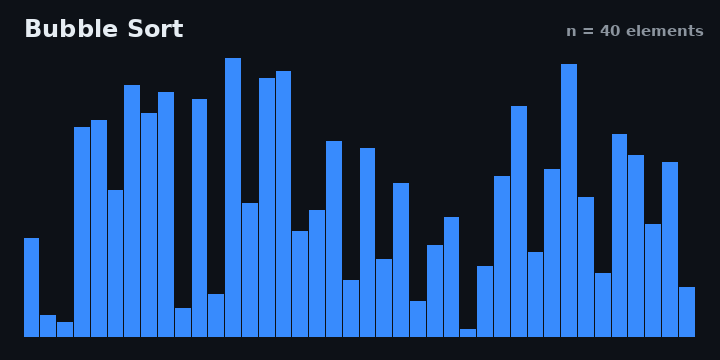
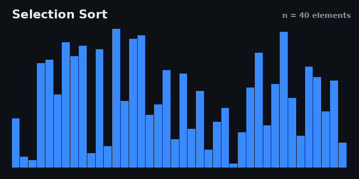

# Sorting Algorithms Visualized in C


Six classic sorting algorithms implemented in pure C, with every comparison and swap recorded and rendered into looping GIF animations. The C code contains no graphics dependencies: each algorithm writes its steps to a plain text "frames" file, and a small Python script turns those files into the animations you see below.

| | |
|---|---|
|  |  |

## How it works

```
┌─────────────┐   .frames files   ┌────────────────┐   GIFs   ┌─────────┐
│  C program  │  ───────────────► │ render_gif.py  │ ───────► │ assets/ │
│  (sortviz)  │    plain text     │ (Pillow)       │          │  *.gif  │
└─────────────┘                   └────────────────┘          └─────────┘
```

1. `sortviz` shuffles an array of 40 values with a fixed seed (so the result is reproducible) and runs each algorithm on an identical copy.
2. Every comparison, swap or write calls `recorder_frame()`, which appends a snapshot of the array to `data/<name>.frames`.
3. `scripts/render_gif.py` parses these snapshots, subsamples long recordings, draws each frame with Pillow and saves a looping GIF. Red bars mark the elements currently being compared or moved, and a green sweep confirms the sorted result at the end.

This separation keeps the algorithms clean and testable: they are ordinary C functions that can be reused as a library, and the recorder becomes a no-op when no file is open.

## The algorithms

| Algorithm | Best | Average | Worst | Memory | Stable |
|---|---|---|---|---|---|
| Bubble sort | O(n) | O(n²) | O(n²) | O(1) | Yes |
| Selection sort | O(n²) | O(n²) | O(n²) | O(1) | No |
| Insertion sort | O(n) | O(n²) | O(n²) | O(1) | Yes |
| Merge sort | O(n log n) | O(n log n) | O(n log n) | O(n) | Yes |
| Quick sort | O(n log n) | O(n log n) | O(n²) | O(log n) | No |
| Heap sort | O(n log n) | O(n log n) | O(n log n) | O(1) | No |

### Bubble Sort



Walks through the array again and again, swapping adjacent elements that are out of order. Large values "bubble up" to the end after each pass.

* **Pros:** trivially simple, stable, detects already sorted input in O(n) thanks to the early exit.
* **Cons:** O(n²) comparisons and swaps make it useless for anything beyond tiny inputs.
* **Where it is used:** almost exclusively in teaching. Occasionally as a final polish pass on nearly sorted data, although insertion sort does that job better.

### Selection Sort



For each position, scans the remaining unsorted part for the minimum and swaps it into place.

* **Pros:** performs at most n-1 swaps, which matters when writes are expensive (e.g. flash memory, EEPROM). Simple and in place.
* **Cons:** always O(n²) comparisons, even on sorted input. Not stable in this classic form.
* **Where it is used:** very small arrays on memory constrained embedded systems where minimizing writes is the priority.

### Insertion Sort


Grows a sorted prefix one element at a time, shifting larger elements to the right until the new element fits. The way most people sort a hand of playing cards.

* **Pros:** excellent on small or nearly sorted data (O(n) best case), stable, in place, works online (can sort a stream as it arrives).
* **Cons:** O(n²) on random or reversed input.
* **Where it is used:** as the small-subarray fallback inside industrial hybrid sorts. Both glibc qsort implementations and Timsort (Python, Java) switch to insertion sort below a threshold of roughly 16 to 64 elements.

### Merge Sort


Divide and conquer: split the array in half, sort each half recursively, then merge the two sorted runs. The animation shows the characteristic block by block merging pattern.

* **Pros:** guaranteed O(n log n) in every case, stable, predictable, parallelizes well, ideal for linked lists and external (on disk) sorting.
* **Cons:** needs O(n) extra memory for arrays; the constant factor is usually higher than quick sort's.
* **Where it is used:** sorting data that does not fit in RAM, stable sorting requirements (databases, Timsort is a merge sort derivative), multi-threaded sorting.

### Quick Sort


Picks a pivot, partitions the array into "smaller than pivot" and "greater than pivot" zones, then recurses on both sides. This implementation uses the Lomuto scheme with the last element as the pivot.

* **Pros:** fastest comparison sort in practice on average thanks to cache friendly sequential access and a small constant factor. In place (apart from the recursion stack).
* **Cons:** O(n²) worst case on adversarial input with a naive pivot choice, not stable.
* **Where it is used:** the default general purpose sort almost everywhere: C standard library qsort, the basis of introsort in C++ std::sort and .NET.

### Heap Sort


Builds a max-heap on top of the array, then repeatedly swaps the maximum (the heap root) to the end and shrinks the heap. The animation shows elements jumping from the front to their final position.

* **Pros:** guaranteed O(n log n), truly in place with O(1) extra memory, immune to adversarial input.
* **Cons:** poor cache locality makes it slower than quick sort in practice, not stable.
* **Where it is used:** real time and safety critical systems that need a hard worst case bound (the Linux kernel uses it), and as the fallback inside introsort when quick sort recursion gets too deep.

## Building and running

Requirements: GCC (or any C11 compiler), GNU Make, Python 3 with Pillow.

```bash
# 1. Clone the repository
git clone https://github.com/<your-username>/sorting-visualizer-c.git
cd sorting-visualizer-c

# 2. Install the rendering dependency
pip install Pillow

# 3. Build, record and render everything in one step
make run
```

`make run` compiles the project, records all six algorithms into `data/` and renders the GIFs into `assets/`.

You can also run the steps individually:

```bash
make                              # just compile
./sortviz quick                   # record only one algorithm
python3 scripts/render_gif.py quick   # render only one GIF
```

To experiment, change `ARRAY_SIZE` or `RANDOM_SEED` in `src/main.c`, or tweak the colors and timing at the top of `scripts/render_gif.py`, then run `make run` again.

## Project structure

```
sorting-visualizer-c/
├── Makefile
├── src/
│   ├── main.c          # array setup, runs all algorithms
│   ├── sorts.c         # the six sorting algorithms
│   ├── sorts.h
│   ├── recorder.c      # writes array snapshots to .frames files
│   └── recorder.h
├── scripts/
│   └── render_gif.py   # turns .frames files into GIFs
├── assets/             # rendered animations (committed, shown above)
└── data/               # intermediate .frames files (ignored by git)
```

## License

MIT, see [LICENSE](LICENSE).
